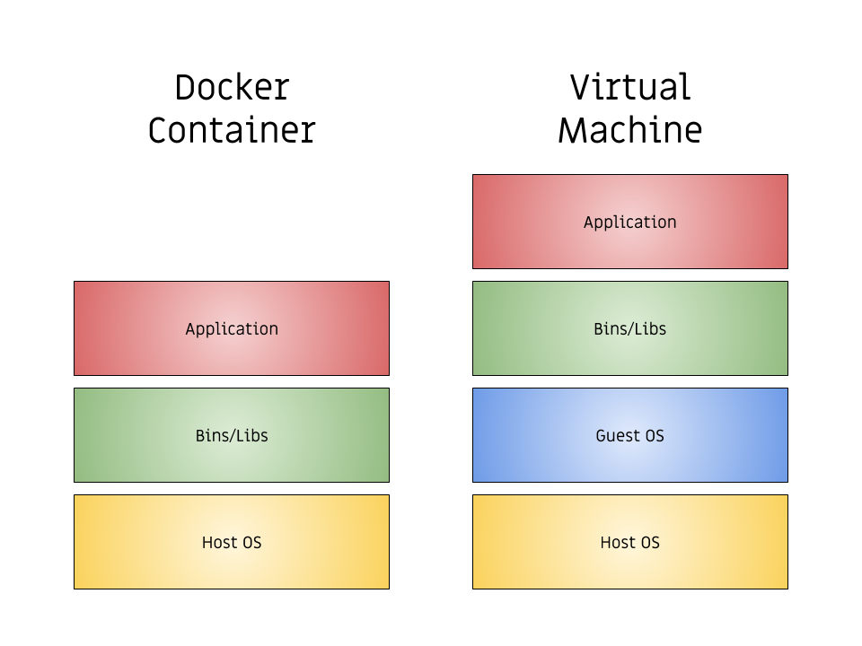

# Chapter 1. Introduction to Docker

Since its first release in 2013, Docker has become the container engine of choice for many developers, and it may be replacing a virtual machine near you soon. This book offers a step-by-step guide that will walk you through the process of building a real PHP web application using Docker while explaining the basics of the platform along the way.

The application we build in this book will do many of the key things that PHP developers need to do on a daily basis, including:

* Installing dependencies using [Composer](https://getcomposer.org/).

* Using a web framework ([SlimPHP](https://www.slimframework.com/)) for routing.

* Getting data from a third-party API.

* Saving data to a database.

* Securely setting environmental variables.

This book was written for seasoned PHP developers who want to learn to develop web applications with Docker, learn how Docker works, and like learning by building real, working applications. Once you've completed this book, you'll be ready for more advanced Docker topics, and I've included some resources to help you at the end.

All the code I include in this book is open source and [freely available on Github](https://github.com/shiphp/weather-app). If you see any problems or you want to suggest an improvement, feel free to make a pull request. Finally, check [www.shiphp.com](https://www.shiphp.com/) often for blog posts, training, and new books on both Docker and PHP.

## What is Docker?

Docker is a platform for managing and running containers. Containers are like [virtual machines](https://en.wikipedia.org/wiki/Virtual_machine), but they don't actually emulate the whole operating system. Instead, all of the containers you run share the same underlying kernel with the host machine, which means that they're much lighter-weight than virtual machines. Because of this, containers are very efficient, and most real-world applications run many containers at once. Docker helps you link these containers together using [networks](https://docs.docker.com/engine/userguide/networking/) of containers, and helps you define your containers using [Docker Compose](https://docs.docker.com/compose/) configuration files. While this book doesn't cover these topics in detail, it will get you started, and more in-depth material is available at [www.shiphp.com](https://www.shiphp.com/).

{width=100%}

## Why Docker?

PHP developers who are familiar with virtual machines or have used [Vagrant](https://www.sitepoint.com/5-easy-ways-getting-started-php-vagrant/) will most easily understand containers by comparing them with virtual machines. The important difference between containers and virtual machines in practice is that you will rarely use *one single* Docker container for your whole application. Instead, you will run your PHP code in one container, your web server in another container, and your database in third container. Some applications I've worked on use dozens of linked containers to operate!

If you haven't used a virtual machine before, Docker containers can still help you improve your development workflow. Developers who work on teams that run PHP and Apache natively on their operating system often run into the "works on my machine" problem. One team member updates the web application and everything seems to work fine, but then when the application is deployed to the server or run by another team member, it mysteriously breaks. Docker solves these problems by allowing developers to set up and share replicable development environments, and then *test and deploy applications in exactly the same state* using containers.

At this point you may want to read a little more about Docker. While this book will walk you through the process of building and running a PHP web application on Docker, it does not attempt to cover the inner-workings of Docker, containers, or operating system virtualization. You can read more on Docker and many of these related topics on [Docker's website](https://www.docker.com/what-docker).

## What can I expect from this book?

While the computer science behind containers is an interesting topic, this book takes a pragmatic approach. Many PHP developers (including myself) are hands-on learners, so I wrote this book to *help people who learn by doing*. Along the way, I've included some diagrams for visual learners, code samples (as well as [a complete code repo on Github](https://github.com/shiphp/weather-app)), and links to free and paid resources to learn more about each of the topics covered.

Reading the [Docker documentation](https://docs.docker.com/) is a good idea, but I find that starting out with a working application gives me better context for the docs, and deepens my understanding of what I read there. If you're a PHP developer, this book will take you on a journey to build your first application and give you that foundation you need to truly understand how Docker works and how you could use it to build better software.

The application we build in this book is simple [REST](https://stackoverflow.com/questions/671118/what-exactly-is-restful-programming) API, but it covers most of the typical problems that PHP developers will need to solve when using Docker. Throughout the course of building this application, I'll show you to install packages using [Composer](https://getcomposer.org/), get data from a third party API, save data to a database, and use environmental variables with Docker. Rather than explain everything up front, most details will be uncovered as you build the application.

The best way to read this book would be to sit down with it and your computer for an afternoon and work through it. Hopefully by the end, you'll be ready to start using Docker for your next PHP project.

There are a few prerequisites to this book. You should have an understanding of [what PHP is](http://php.net/manual/en/intro-whatis.php) and the basics of its syntax, you should know how to open your computer's terminal and run PHP scripts from it, and you should have version 17 of the community edition of [Docker (available for Mac, Windows, or Linux)](https://www.docker.com/community-edition) installed on your computer. Assuming you've got those things, let's get started!